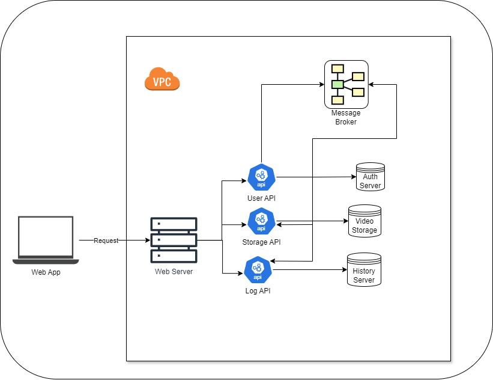

# System Design Project

## Description
This project is a video-to-audio conversion service designed as a set of microservices.

## Services
- Login
- Upload
- Download
- Process
- History

## Technology Stack
- Frontend: ReactJS
- Backend: Python (Flask)
- Database: MySQL
- Containerization: Docker
- Orchestration: Kubernetes
- Deployment: Azure
